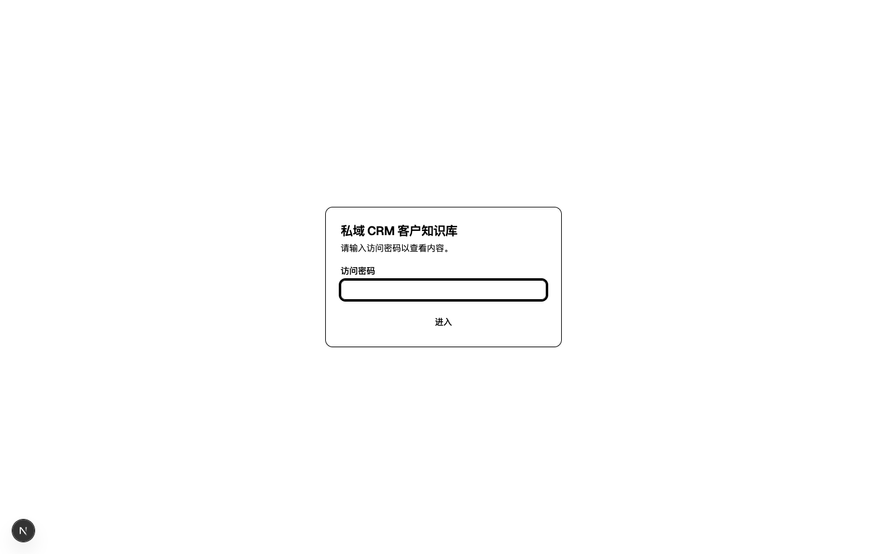
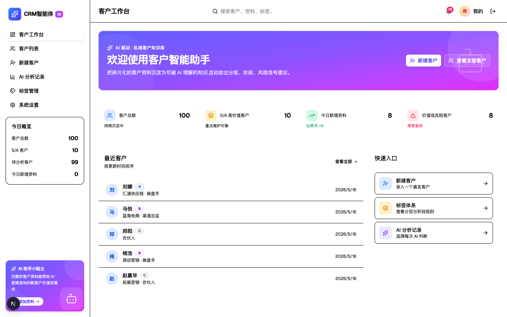
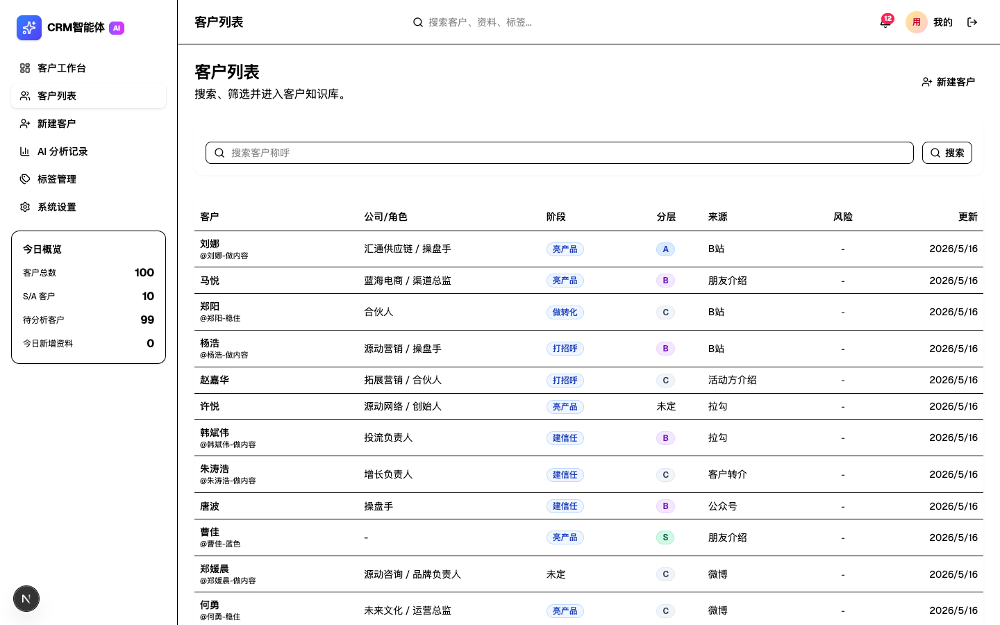
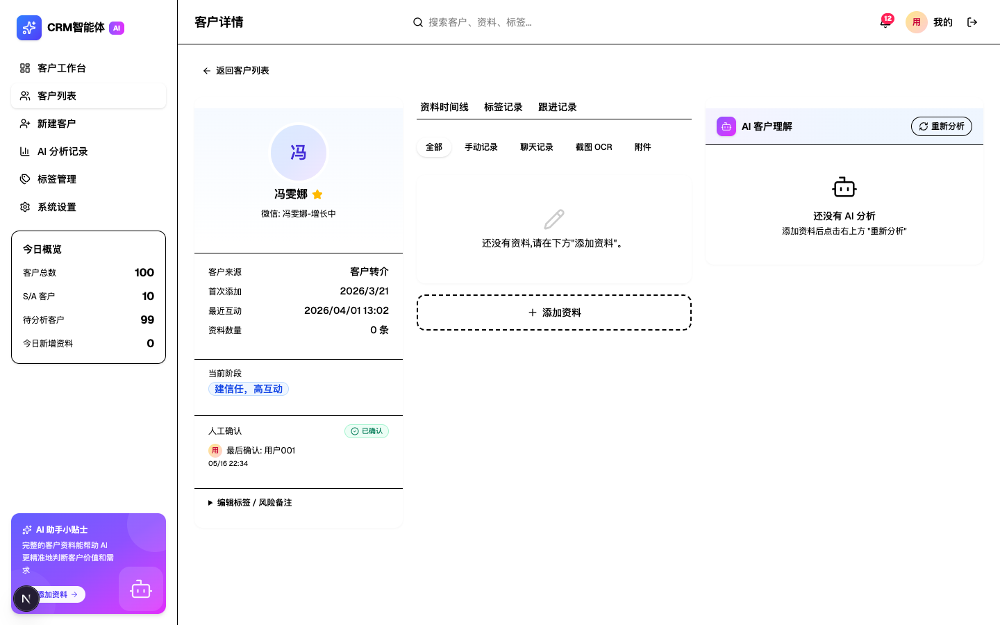
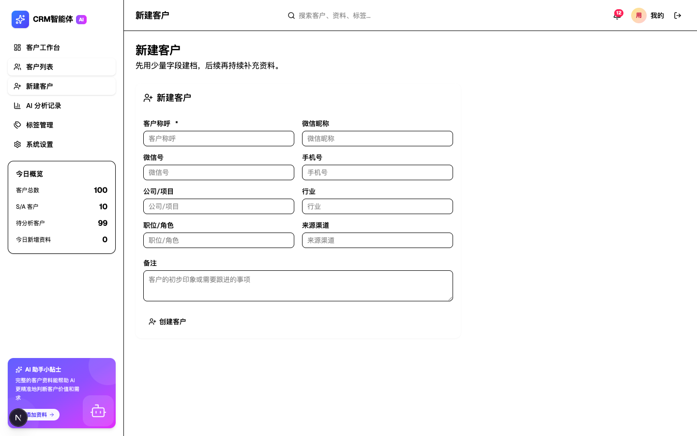
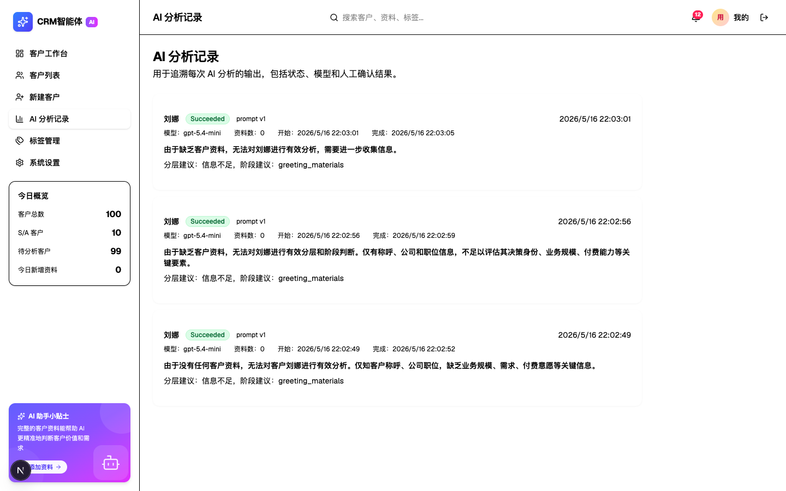
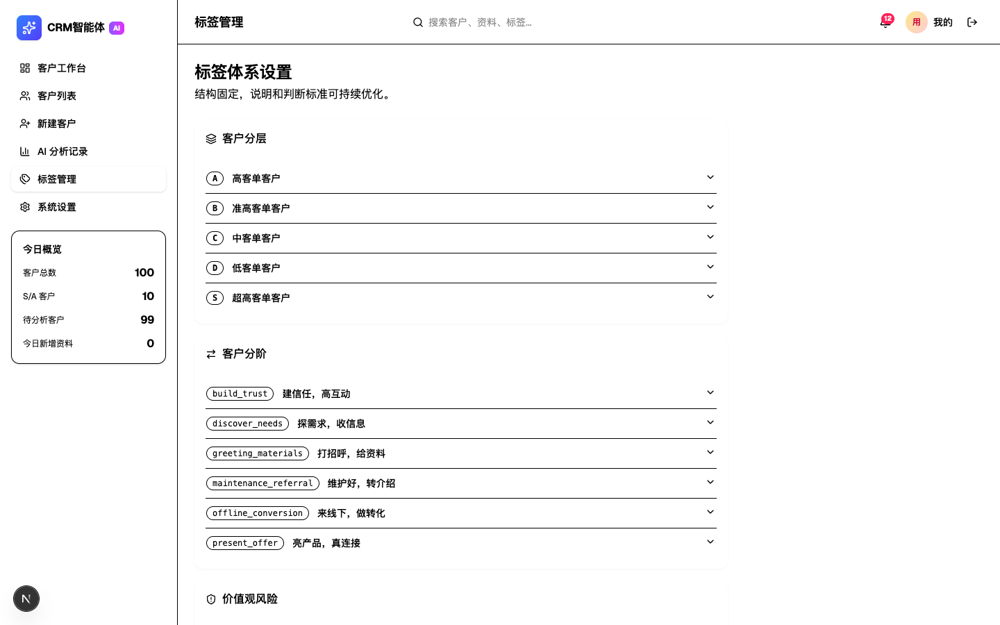

# 私域 CRM 客户知识库 - 使用手册

## 1. 系统简介

私域 CRM 客户知识库是一个面向私域业务团队的客户关系管理系统。核心功能包括：

- **客户建档**：记录客户基本信息、微信资料、公司背景
- **资料沉淀**：按时间线整理聊天记录、截图 OCR、附件等客户资料
- **AI 分析**：利用 AI 自动分析客户价值、所处阶段、潜在风险
- **分层分阶**：通过标签体系对客户进行分层（S/A/B/C/D）和分阶管理
- **风险预警**：识别价值观风险客户，避免业务损失

---

## 2. 登录系统

打开系统地址后，会看到登录页面：

输入访问密码，点击「进入」即可登录系统。

---

## 3. 客户工作台（首页）

登录后进入客户工作台首页：

首页包含以下模块：

### 3.1 数据概览
顶部四个统计卡片展示：
- **客户总数**：系统中所有客户数量
- **S/A 高价值客户**：重点维护的高价值客户数量
- **今日新增资料**：当天新上传的客户资料数
- **价值观风险客户**：被标记为存在价值观风险的客户数

### 3.2 最近客户
展示最近更新的 5 位客户，点击可查看详情。

### 3.3 快速入口
- **新建客户**：快速跳转到客户创建页面
- **标签体系**：查看客户分层和分阶规则
- **AI 分析记录**：追溯每次 AI 分析的结果

---

## 4. 客户列表

点击左侧导航「客户列表」进入客户管理页面：

### 4.1 列表字段
表格展示客户核心信息：
- **客户**：客户称呼（带微信昵称备注）
- **公司/角色**：所属公司和职位
- **阶段**：当前所处业务阶段
- **分层**：客户价值分层（S/A/B/C/D）
- **来源**：客户获取渠道
- **风险**：是否存在价值观风险
- **更新**：最后更新时间

### 4.2 搜索
顶部搜索框支持按客户称呼快速查找。

### 4.3 新建客户
点击右上角「新建客户」按钮，跳转到客户创建页面。

---

## 5. 客户详情

点击列表中的客户，进入客户详情页：

详情页采用三栏布局：

### 5.1 左侧 - 客户档案
- **头像与称呼**：客户标识信息
- **分层徽章**：S/A/B/C/D 分层标签，S 层为金色高亮
- **基本信息**：微信昵称、公司、职位、来源渠道
- **关键数据**：首次添加时间、最近互动时间、资料数量
- **当前阶段**：可视化展示所处业务阶段
- **人工确认**：记录最后确认人和确认时间
- **标签编辑**：编辑分层、阶段、风险备注

### 5.2 中间 - 资料时间线
按时间分组展示客户的所有资料：
- **手动记录**：人工录入的笔记和观察
- **聊天记录**：微信聊天导出内容
- **截图 OCR**：图片文字识别结果
- **附件**：上传的文件资料

点击「+ 添加资料」可为客户补充新内容。

### 5.3 右侧 - AI 客户理解
展示 AI 对该客户的综合分析：
- **价值评估**：客户付费能力和业务价值判断
- **阶段判断**：当前所处销售/运营阶段
- **风险信号**：潜在风险提醒
- **下一步建议**：AI 给出的跟进建议

点击「重新分析」可基于最新资料重新生成分析结果。

---

## 6. 新建客户

点击「新建客户」进入创建页面：

填写以下信息：
- **客户称呼***：必填，用于系统内标识
- **微信昵称**：客户在微信中的昵称
- **微信号**：可选，便于精准查找
- **手机号**：可选，联系方式
- **公司/项目**：客户所在公司或参与项目
- **行业**：所属行业领域
- **职位/角色**：在公司的职位或角色
- **来源渠道**：如何获取该客户（朋友介绍、公众号、活动等）
- **备注**：初步印象或需要跟进的事项

填写完成后点击「创建客户」保存。

---

## 7. AI 分析记录

点击「AI 分析记录」查看所有 AI 分析历史：

每条记录展示：
- **分析状态**：Succeeded / Failed / Pending
- **客户名称**：被分析的客户
- **模型版本**：使用的 AI 模型
- **资料数**：分析时参考的资料数量
- **开始/完成时间**：分析耗时
- **分析结论**：AI 给出的分层、阶段建议
- **原因说明**：判断依据摘要

---

## 8. 标签管理

点击「标签管理」进入标签体系配置页面：

### 8.1 客户分层
预设 5 级分层标准：
- **S - 超高客单客户**：最高价值客户
- **A - 高客单客户**：高价值客户
- **B - 准高客单客户**：潜在高价值客户
- **C - 中客单客户**：中等价值客户
- **D - 低客单客户**：基础价值客户

点击可展开查看各分层的详细定义和判断标准。

### 8.2 客户分阶
预设 6 个业务阶段：
- **greeting_materials**：打招呼，给资料
- **build_trust**：建信任，高互动
- **discover_needs**：探需求，收信息
- **present_offer**：亮产品，真连接
- **offline_conversion**：来线下，做转化
- **maintenance_referral**：维护好，转介绍

### 8.3 价值观风险
独立的风险标签，用于标记可能存在价值观冲突的客户。

---

## 9. 左侧边栏

所有页面共享左侧边栏，包含：

### 9.1 导航菜单
- 客户工作台
- 客户列表
- 新建客户
- AI 分析记录
- 标签管理
- 系统设置

### 9.2 今日概览
实时展示关键数据：
- 客户总数
- S/A 客户数
- 待分析客户数
- 今日新增资料数

### 9.3 AI 助手小贴士
底部浮动卡片，提供使用提示和快捷操作入口。

---

## 10. 顶部操作栏

### 10.1 页面标题
根据当前页面自动切换标题。

### 10.2 全局搜索
支持搜索客户、资料、标签。

### 10.3 通知中心
铃铛图标显示未读通知数量。

### 10.4 用户菜单
- 头像和昵称显示
- 退出登录按钮

---

## 11. 核心工作流

### 11.1 日常录入流程
1. 获取新客户信息 → 点击「新建客户」建档
2. 与客户互动后 → 进入客户详情 → 「添加资料」
3. 积累足够资料后 → 点击「重新分析」获取 AI 洞察
4. 定期复核 → 调整分层、阶段标签

### 11.2 风险客户处理
1. 在客户列表关注「风险」标识
2. 进入详情查看 AI 风险分析
3. 在「编辑标签/风险备注」中记录处理决策
4. 严重风险客户可归档处理

### 11.3 高价值客户维护
1. 首页关注「S/A 高价值客户」数量
2. 定期查看高价值客户的资料更新
3. 利用 AI 建议制定跟进策略
4. 在「人工确认」中记录维护动作
